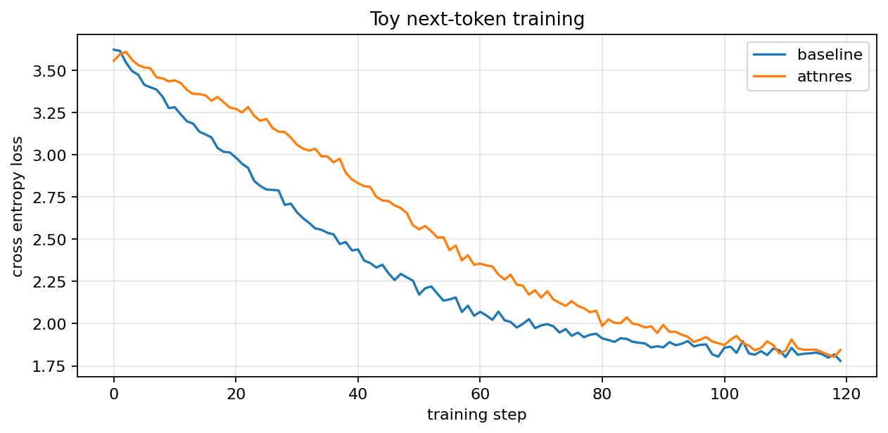
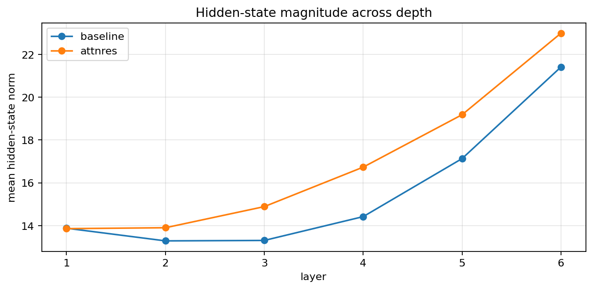
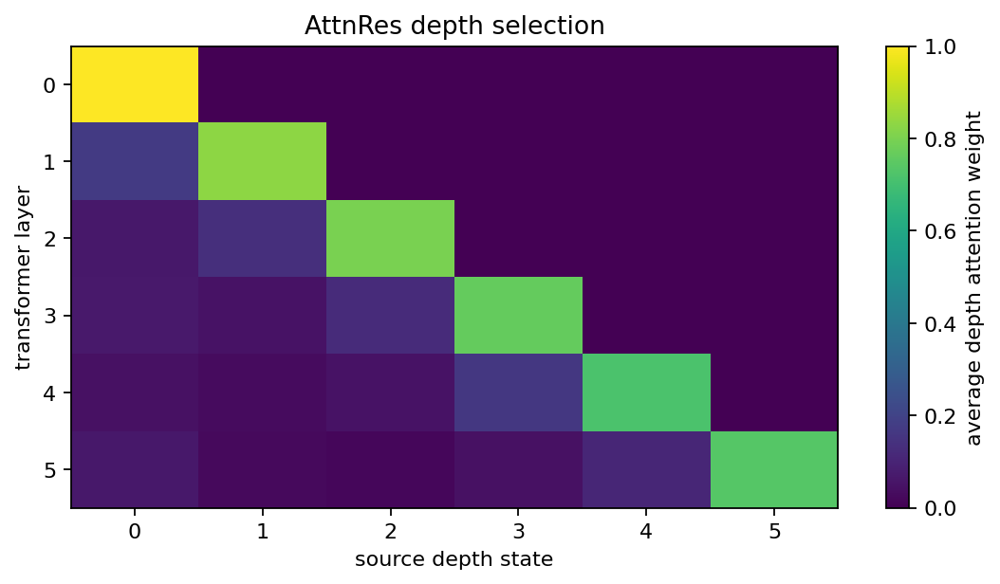
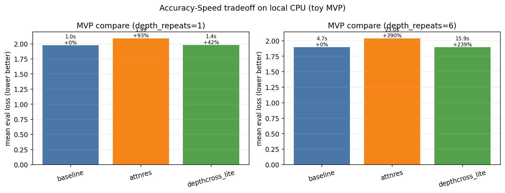

# AttnRes Toy Jupyter

这是一个面向个人电脑和初学者的 Attention Residuals 原理复现项目。

它不追求复现论文的大规模训练结果，而是用一个 6 层小型 causal Transformer，把论文的核心思想直观展示出来：

- `baseline`：标准 PreNorm 残差累加
- `attnres`：沿深度方向对历史隐藏状态做注意力聚合

## 项目简介

MoonshotAI 在 Attention Residuals 中提出：标准残差会把历史层表示统一累加，随着网络变深，单层贡献更容易被稀释，隐藏状态幅值也可能持续增长。

这个项目用一个 6 层 toy Transformer 复现这个思想，重点不是追求论文级指标，而是让你在 Jupyter 里直接看到：

- 标准残差和 AttnRes 的训练行为差异
- 不同深度下隐藏状态范数的变化
- AttnRes 如何在深度维度上学会“选择性读取”历史层

## 你能看到什么

这个项目重点展示三件事：

- 小型 next-token prediction 任务上的训练曲线
- 随深度增加时隐藏状态范数的变化
- AttnRes 学到的深度选择权重热力图

## 关键结果图

### 1. 训练 loss 曲线



说明：展示 baseline 与 AttnRes 在 toy next-token prediction 任务上的训练过程，帮助快速确认两种结构都能学到规律。

### 2. 隐藏状态范数随深度变化



说明：用于观察随着层数增加，表示幅值是否持续放大。这是论文讨论 PreNorm 残差稀释问题时的一个关键观察角度。

### 3. AttnRes 深度选择热力图



说明：横轴是历史深度状态，纵轴是当前层。颜色越亮，表示该层越偏向使用那个历史状态，而不是做统一相加。

### 4. MVP 性能-效果权衡（本地 CPU）



说明：在本地小规模重复实验下，对比 `baseline`、`attnres`、`depthcross_lite` 在不同 `depth_repeats` 设定的平均 eval loss 和训练耗时，用于快速判断“提升是否显著且是否划算”。

## 快速开始

```bash
python3.11 -m venv .venv
source .venv/bin/activate
pip install -U pip
pip install -r requirements.txt
python -m ipykernel install --user --name attnres-toy-jupyter --display-name "Python (attnres-toy-jupyter)"
jupyter lab
```

然后打开：

- `notebooks/attnres_toy_demo.ipynb`

直接按顺序运行即可。

## 项目结构

- `src/attnres_toy.py`：toy 数据生成、baseline 模型、AttnRes 模型、训练与画图工具
- `notebooks/attnres_toy_demo.ipynb`：带大量中文解释的实验 notebook
- `notebooks/attnres_toy_demo.executed.ipynb`：已执行并带输出的展示版 notebook
- `figures/`：自动导出的关键结果图

## 说明

- `src/attnres_toy.py` 已补充大量中文注释，适合边读边理解参数和张量流动
- notebook 会自动把关键图导出到 `figures/`，便于上传到 GitHub
- 这是一个机制演示项目，不是论文中的训练规模复现
- License: MIT，适合公开分享和二次使用

## 参考链接

- 技术报告（PDF）：`https://github.com/MoonshotAI/Attention-Residuals/blob/master/Attention_Residuals.pdf`
- 官方仓库：`https://github.com/MoonshotAI/Attention-Residuals`
- Kimi 官方 X 账号：`https://x.com/Kimi_Moonshot`
